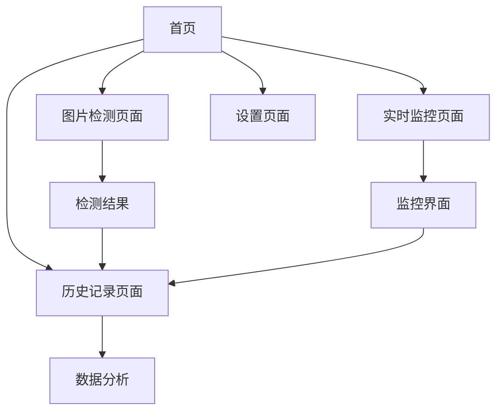

# 咖啡豆烘焙度检测Web应用 - 产品需求文档

## 1. Product Overview
咖啡豆烘焙度检测Web应用是一个专业的咖啡烘焙辅助工具，通过AI图像识别技术帮助用户精确检测咖啡豆的Agtron烘焙度值。
- 解决咖啡烘焙师和爱好者在烘焙过程中难以准确判断烘焙度的问题，提供科学的数据支持和实时监控功能。
- 目标用户包括专业咖啡烘焙师、咖啡店经营者和咖啡爱好者，帮助他们提升烘焙质量和一致性。

## 2. Core Features

### 2.1 Feature Module
我们的咖啡豆烘焙度检测应用包含以下主要页面：
1. **首页**：应用介绍、功能导航、快速检测入口
2. **图片检测页面**：拍照或上传图片检测Agtron值、检测结果展示
3. **实时监控页面**：摄像头实时预览、定时截图设置、烘焙度监控
4. **历史记录页面**：检测历史查看、数据统计分析
5. **设置页面**：检测参数配置、提醒设置、用户偏好

### 2.2 Page Details

| Page Name | Module Name | Feature description |
|-----------|-------------|---------------------|
| 首页 | 导航模块 | 显示应用logo、功能介绍卡片、快速进入检测模式按钮 |
| 首页 | 快速检测 | 提供拍照检测和实时监控两个主要功能入口 |
| 图片检测页面 | 图片输入 | 支持摄像头拍照、相册选择图片、拖拽上传功能 |
| 图片检测页面 | 检测结果 | 显示Agtron值、烘焙度等级、置信度、建议信息 |
| 图片检测页面 | 结果操作 | 保存检测记录、分享结果、重新检测功能 |
| 实时监控页面 | 摄像头预览 | 实时显示摄像头画面、支持焦点调节和亮度调整 |
| 实时监控页面 | 监控设置 | 设置目标烘焙度、定时截图间隔、提醒阈值 |
| 实时监控页面 | 检测控制 | 手动截图检测、开始/停止监控、暂停功能 |
| 实时监控页面 | 实时反馈 | 显示当前检测到的烘焙度、进度条、达标提醒 |
| 历史记录页面 | 记录列表 | 按时间排序显示检测历史、支持筛选和搜索 |
| 历史记录页面 | 数据分析 | 烘焙度趋势图表、统计数据、导出功能 |
| 设置页面 | 检测参数 | 调整检测精度、校准设置、算法选择 |
| 设置页面 | 提醒设置 | 声音提醒、震动提醒、通知权限管理 |

## 3. Core Process

**图片检测流程：**
用户进入首页 → 选择图片检测模式 → 拍照或上传图片 → AI分析处理 → 显示Agtron值和烘焙度等级 → 保存记录或重新检测

**实时监控流程：**
用户进入首页 → 选择实时监控模式 → 设置目标烘焙度和监控参数 → 开启摄像头预览 → 开始监控 → 定时或手动截图检测 → 实时显示当前烘焙度 → 达到目标烘焙度时发出提醒 → 停止监控并保存数据

## 4. User Interface Design

### 4.1 Design Style
- **主色调**：深棕色(#8B4513)和奶油色(#F5F5DC)，体现咖啡主题
- **辅助色**：橙色(#FF8C00)用于强调和按钮，绿色(#32CD32)用于成功状态
- **按钮样式**：圆角矩形按钮，具有轻微阴影效果
- **字体**：主标题使用18px粗体，正文使用14px常规字体，数据显示使用16px等宽字体
- **布局风格**：卡片式设计，顶部导航栏，底部功能按钮
- **图标风格**：使用线性图标，简洁现代，配合咖啡相关emoji如☕️📷📊

### 4.2 Page Design Overview

| Page Name | Module Name | UI Elements |
|-----------|-------------|-------------|
| 首页 | 导航模块 | 顶部固定导航栏，深棕色背景，白色文字，居中logo |
| 首页 | 功能卡片 | 两个大型功能卡片，圆角设计，橙色边框，图标+文字布局 |
| 图片检测页面 | 图片输入区 | 虚线边框的上传区域，支持拖拽，中央显示相机图标 |
| 图片检测页面 | 结果展示 | 大号数字显示Agtron值，进度条显示烘焙度等级，卡片式布局 |
| 实时监控页面 | 摄像头预览 | 全屏摄像头画面，顶部覆盖半透明控制栏 |
| 实时监控页面 | 控制面板 | 底部固定控制栏，包含开始/停止按钮和设置选项 |
| 历史记录页面 | 记录列表 | 时间线式布局，每条记录显示缩略图、时间、Agtron值 |
| 设置页面 | 设置项 | 分组的设置选项，开关按钮，滑块控件 |

### 4.3 Responsiveness
应用采用移动端优先的响应式设计，针对手机浏览器进行优化，支持触摸操作和手势控制。在平板和桌面端会适当调整布局以充分利用屏幕空间。