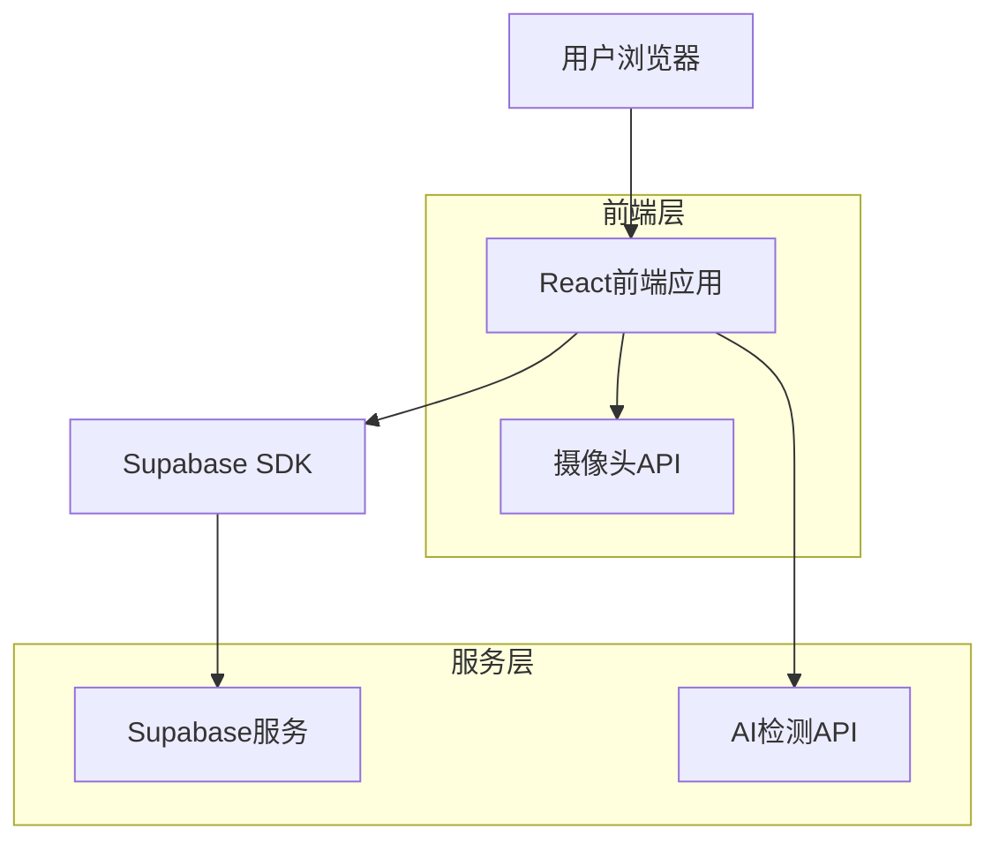
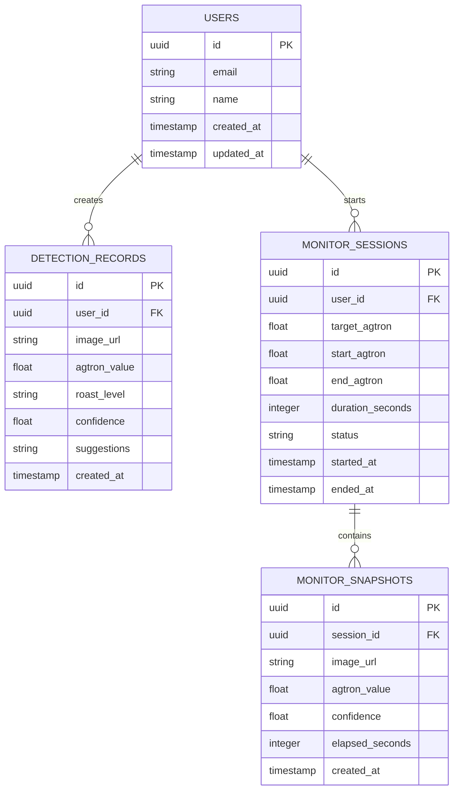

# 咖啡豆烘焙度检测Web应用 - 技术架构文档

## 1. Architecture design



## 2. Technology Description

* **前端**: React\@18 + TypeScript + Tailwind CSS + Vite

* **后端**: Supabase (认证、数据库、存储)

* **AI服务**: 第三方图像识别API或自建模型服务

* **部署**: Vercel

## 3. Route definitions

| Route     | Purpose                   |
| --------- | ------------------------- |
| /         | 首页，显示应用介绍和主要功能入口          |
| /detect   | 图片检测页面，支持拍照和上传图片检测Agtron值 |
| /monitor  | 实时监控页面，摄像头实时监控烘焙过程        |
| /history  | 历史记录页面，查看检测历史和数据分析        |
| /settings | 设置页面，配置检测参数和用户偏好          |
| /login    | 登录页面，用户认证                 |
| /profile  | 用户资料页面，管理个人信息             |

## 4. API definitions

### 4.1 Core API

**图片检测API**

```
POST /api/detect/image
```

Request:

| Param Name | Param Type  | isRequired | Description      |
| ---------- | ----------- | ---------- | ---------------- |
| image      | File/Base64 | true       | 咖啡豆图片文件或Base64编码 |
| user\_id   | string      | false      | 用户ID，用于保存记录      |

Response:

| Param Name    | Param Type | Description        |
| ------------- | ---------- | ------------------ |
| agtron\_value | number     | Agtron烘焙度数值(0-100) |
| roast\_level  | string     | 烘焙度等级(浅烘/中烘/深烘)    |
| confidence    | number     | 检测置信度(0-1)         |
| suggestions   | string     | 烘焙建议               |

Example Response:

```json
{
  "agtron_value": 65,
  "roast_level": "中烘",
  "confidence": 0.92,
  "suggestions": "适合制作手冲咖啡，建议研磨度为中粗"
}
```

**实时监控API**

```
POST /api/monitor/analyze
```

Request:

| Param Name     | Param Type  | isRequired | Description |
| -------------- | ----------- | ---------- | ----------- |
| image          | File/Base64 | true       | 实时截图        |
| session\_id    | string      | true       | 监控会话ID      |
| target\_agtron | number      | false      | 目标Agtron值   |

Response:

| Param Name      | Param Type | Description |
| --------------- | ---------- | ----------- |
| current\_agtron | number     | 当前Agtron值   |
| progress        | number     | 烘焙进度百分比     |
| should\_alert   | boolean    | 是否需要提醒      |
| time\_remaining | number     | 预估剩余时间(秒)   |

## 5. Data model

### 5.1 Data model definition



### 5.2 Data Definition Language

**检测记录表 (detection\_records)**

```sql
-- 创建检测记录表
CREATE TABLE detection_records (
  id UUID PRIMARY KEY DEFAULT gen_random_uuid(),
  user_id UUID REFERENCES auth.users(id),
  image_url TEXT NOT NULL,
  agtron_value FLOAT NOT NULL CHECK (agtron_value >= 0 AND agtron_value <= 100),
  roast_level VARCHAR(20) NOT NULL,
  confidence FLOAT NOT NULL CHECK (confidence >= 0 AND confidence <= 1),
  suggestions TEXT,
  created_at TIMESTAMP WITH TIME ZONE DEFAULT NOW()
);

-- 创建索引
CREATE INDEX idx_detection_records_user_id ON detection_records(user_id);
CREATE INDEX idx_detection_records_created_at ON detection_records(created_at DESC);
CREATE INDEX idx_detection_records_agtron ON detection_records(agtron_value);

-- 设置RLS策略
ALTER TABLE detection_records ENABLE ROW LEVEL SECURITY;
CREATE POLICY "Users can view own records" ON detection_records FOR SELECT USING (auth.uid() = user_id);
CREATE POLICY "Users can insert own records" ON detection_records FOR INSERT WITH CHECK (auth.uid() = user_id);

-- 授权
GRANT SELECT ON detection_records TO anon;
GRANT ALL PRIVILEGES ON detection_records TO authenticated;
```

**监控会话表 (monitor\_sessions)**

```sql
-- 创建监控会话表
CREATE TABLE monitor_sessions (
  id UUID PRIMARY KEY DEFAULT gen_random_uuid(),
  user_id UUID REFERENCES auth.users(id),
  target_agtron FLOAT CHECK (target_agtron >= 0 AND target_agtron <= 100),
  start_agtron FLOAT CHECK (start_agtron >= 0 AND start_agtron <= 100),
  end_agtron FLOAT CHECK (end_agtron >= 0 AND end_agtron <= 100),
  duration_seconds INTEGER DEFAULT 0,
  status VARCHAR(20) DEFAULT 'active' CHECK (status IN ('active', 'completed', 'cancelled')),
  started_at TIMESTAMP WITH TIME ZONE DEFAULT NOW(),
  ended_at TIMESTAMP WITH TIME ZONE
);

-- 创建索引
CREATE INDEX idx_monitor_sessions_user_id ON monitor_sessions(user_id);
CREATE INDEX idx_monitor_sessions_status ON monitor_sessions(status);
CREATE INDEX idx_monitor_sessions_started_at ON monitor_sessions(started_at DESC);

-- 设置RLS策略
ALTER TABLE monitor_sessions ENABLE ROW LEVEL SECURITY;
CREATE POLICY "Users can manage own sessions" ON monitor_sessions FOR ALL USING (auth.uid() = user_id);

-- 授权
GRANT SELECT ON monitor_sessions TO anon;
GRANT ALL PRIVILEGES ON monitor_sessions TO authenticated;
```

**监控快照表 (monitor\_snapshots)**

```sql
-- 创建监控快照表
CREATE TABLE monitor_snapshots (
  id UUID PRIMARY KEY DEFAULT gen_random_uuid(),
  session_id UUID REFERENCES monitor_sessions(id) ON DELETE CASCADE,
  image_url TEXT NOT NULL,
  agtron_value FLOAT NOT NULL CHECK (agtron_value >= 0 AND agtron_value <= 100),
  confidence FLOAT NOT NULL CHECK (confidence >= 0 AND confidence <= 1),
  elapsed_seconds INTEGER NOT NULL DEFAULT 0,
  created_at TIMESTAMP WITH TIME ZONE DEFAULT NOW()
);

-- 创建索引
CREATE INDEX idx_monitor_snapshots_session_id ON monitor_snapshots(session_id);
CREATE INDEX idx_monitor_snapshots_created_at ON monitor_snapshots(created_at);
CREATE INDEX idx_monitor_snapshots_elapsed ON monitor_snapshots(elapsed_seconds);

-- 设置RLS策略
ALTER TABLE monitor_snapshots ENABLE ROW LEVEL SECURITY;
CREATE POLICY "Users can view snapshots of own sessions" ON monitor_snapshots FOR SELECT 
  USING (session_id IN (SELECT id FROM monitor_sessions WHERE user_id = auth.uid()));
CREATE POLICY "Users can insert snapshots to own sessions" ON monitor_snapshots FOR INSERT 
  WITH CHECK (session_id IN (SELECT id FROM monitor_sessions WHERE user_id = auth.uid()));

-- 授权
GRANT SELECT ON monitor_snapshots TO anon;
GRANT ALL PRIVILEGES ON monitor_snapshots TO authenticated;
```

**初始化数据**

```sql
-- 插入示例烘焙度等级配置
CREATE TABLE roast_levels (
  id SERIAL PRIMARY KEY,
  name VARCHAR(20) NOT NULL,
  agtron_min FLOAT NOT NULL,
  agtron_max FLOAT NOT NULL,
  description TEXT
);

INSERT INTO roast_levels (name, agtron_min, agtron_max, description) VALUES
('极浅烘', 90, 100, '保留最多的酸味和花香，适合浅烘爱好者'),
('浅烘', 75, 89, '明亮的酸味，果香突出，适合手冲'),
('中浅烘', 65, 74, '酸甜平衡，香气丰富'),
('中烘', 55, 64, '酸甜平衡，醇厚度增加'),
('中深烘', 45, 54, '苦甜平衡，适合意式咖啡'),
('深烘', 35, 44, '苦味突出，油脂丰富'),
('极深烘', 25, 34, '强烈苦味，适合加奶咖啡');
```

